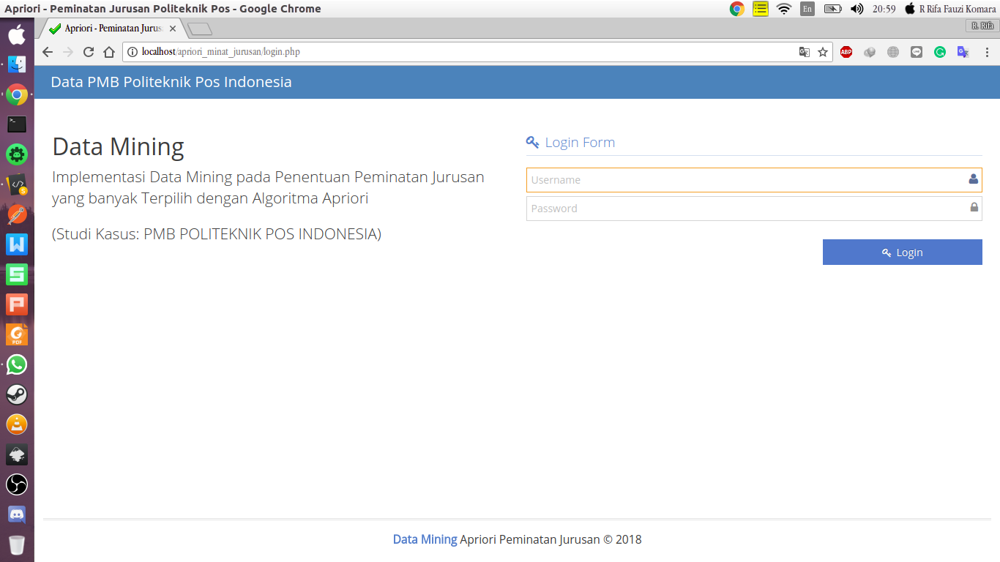
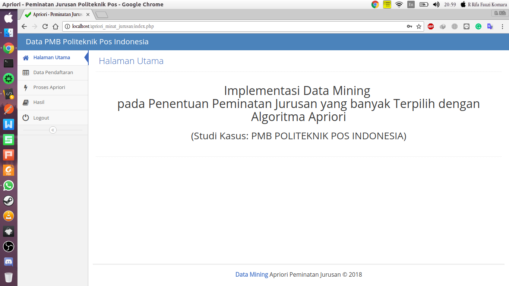
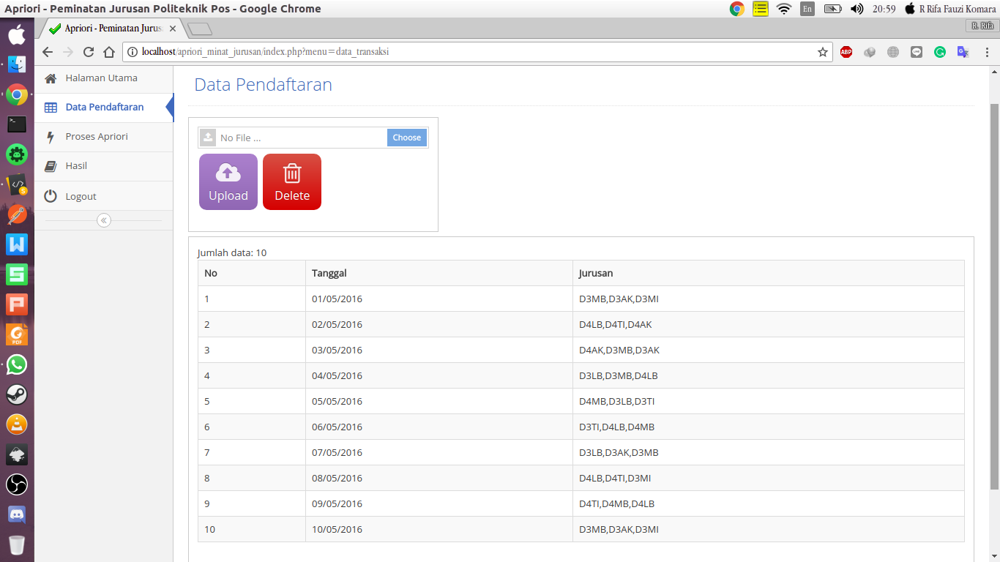
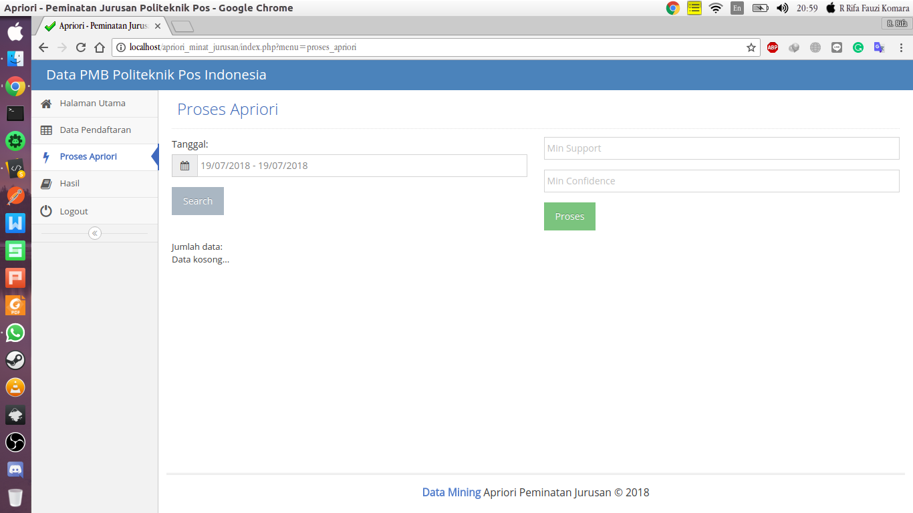
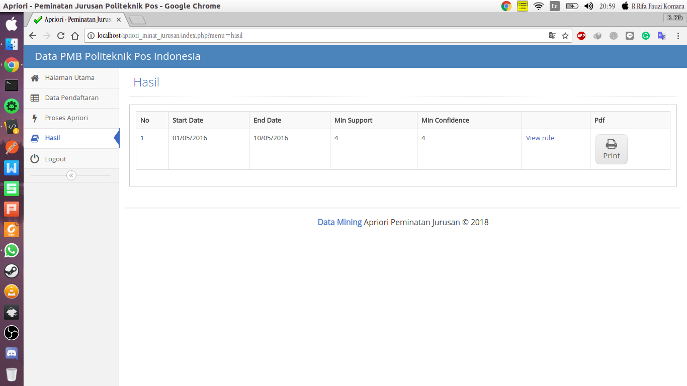

## Aplikasi Peminatan Jurusan Menggunakan Metode Association Rule dan Algoritma Apriori Berbasis Web

## Screenshots

<pre>
                                    
</pre>

### Fitur aplikasi

* [x] Halaman **Login** sebagai admin untuk menginputkan data yang dibutuhkan untuk mengola peminatan jurusan.
* [x] Halaman **Data Pendaftaran** terdapat beberapa fungsi, yaitu untuk mengampload file excel degan format seperti digambar setelah itu akan di tampilkan untuk datanya.
* [x] Halaman **Proses Apriori** untuk menentukan ***Support Level dan Confidence*** dan menentukan ***Range*** dari mahasiswa yang di inputkan di halaman ***Data Pendaftaran***.
* [x] Halaman **Hasil** akan menampilkan data jurusan yang paling banyak dipilih dan fitur cetak.

### Petunjuk menjalankan source code aplikasi

1. Login terlebih dahulu.
2. Masukan data excell.
3. Tentukan range data sesuai dengan excell dan tentukan juga untuk ***Min Support*** dan ***Min Confidence***.
4. Cetak hasil data akhirnya

### Demo
1. Username Administrator: user = admin & pass = admin
2. Username User Direktur: user = user & pass = user

Link website <a href="http://apriori.rifafauzi.com">here</a>

### Issue
Jika ada masalah ketika mendemo website, sila hub saya :D

### Format
Untuk format dokumennya menggunakan exel, kalian bisa download <a href="https://github.com/rrifafauzikomara/Apriori-and-AssociationRule-WebBased/tree/master/Format">disini</a>

## Author

* **R Rifa Fauzi Komara**

Jangan lupa untuk follow dan ★

Untuk Database bisa hub : 081-221-841-320
